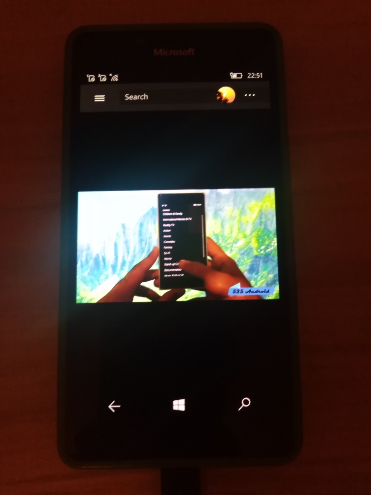

# YoutubeApp v1.0.41-alpha
My fork of Unofficial Youtube Client (UWP app for Desktop)

## About
The Unofficial Youtube Client is a youtube application built in UWP using the Google Dotnet API libraries with a goal of improving upon the ad infested and under-featured apps found on the windows store. The project strives to provide a coherent and simplistic UI while providing responsive and battery considerate performance across the board. Due to the limitations of the Google API, work arounds are being found for home page recommendations and viewing history.

## Screenshots

## 1-min Video (Youtube)
https://youtu.be/LSn6dLq6zEY

## Features (the info from original readme...)
- Windows Styling Integration
- Hardware Video Decoding
- Exceptional Performance (for reasons listed above)
- Picture in Picture mode
- Download videos

## My 2 cents / Status 
- RnD (41 % complete)
- Min. os win sdk : 15063
- VLC & VideoLib synthez 
- GoogleAuth-on-W10M fixed
- Experimental "VLCLibSharp uwp edition" library (for VS 2017 compatibility and best on-device debugging)
- Hardware button back-to-main-page fixed
- Flyout menu auto-hiding added 
- Draft / Proto (UI damaged very hard - no video comments, no mediacontrols, etc.!)

## Credits / References
- MIT
- https://github.com/Saghen  Liam Dyer aka Saghen
- https://github.com/Saghen/UWP-Youtube-Client  Liam Dyer's original Unofficial Youtube Client

## How to try it / fix it
1. Use [Google developers console](https://console.developers.google.com/) to register your own Google Youtube API v3 items (Google Youtube API Credentials):
- Api key
- Client Id
- Client Secret

2. Enter that items (Google Youtube API Credentials) at Settings page

3. Run the app, explore video/audio deals...  

4. Fix the bugs / improve UI... =)

## ..
As is. No support. RnD only. DIY

## .
[m][e] 2024

