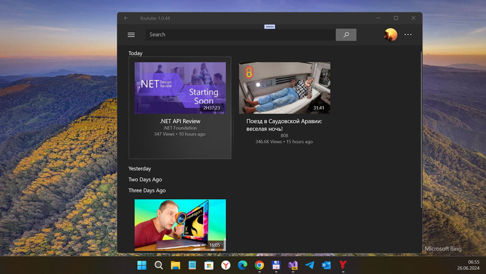
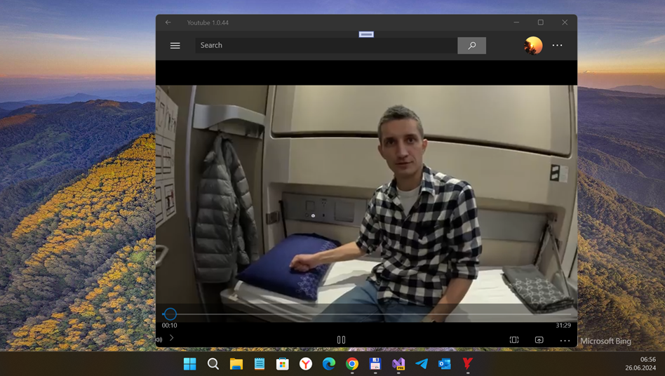
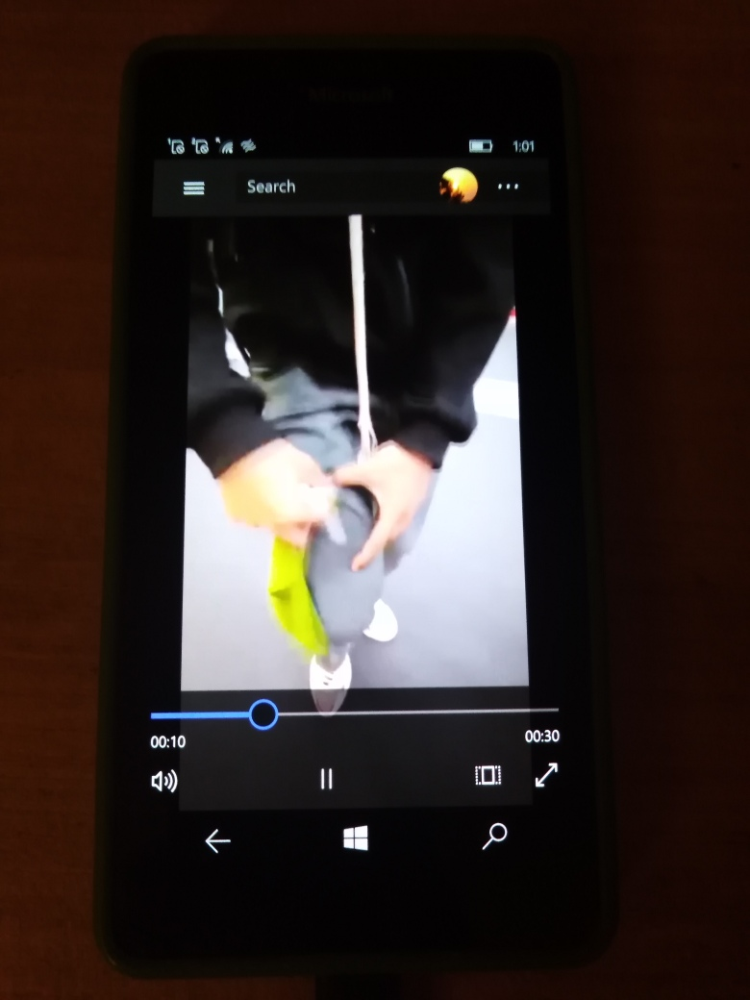

# YoutubeApp v1.0.44-alpha
My fork of Unofficial Youtube Client (UWP app for Desktop)

## About
The Unofficial Youtube Client is a youtube application built in UWP using the Google Dotnet API libraries with a goal of improving upon the ad infested and under-featured apps found on the windows store. The project strives to provide a coherent and simplistic UI while providing responsive and battery considerate performance across the board. Due to the limitations of the Google API, work arounds are being found for home page recommendations and viewing history.

## Screenshots

## 1-min Video (Youtube)
https://youtu.be/LSn6dLq6zEY

## My 2 cents / Status 
- RnD (44 % complete)
- Min. os win sdk : 14393
- VLC & VideoLib synthez 
- GoogleAuth-on-W10M fixed
- VLCMediaElement "injected" (!)
- Experimental "VLCX uwp edition" library (for VS 2017 compatibility and best on-device debugging)
- Hardware button back-to-main-page fixed
- Flyout menu auto-hiding added 
- Draft / Proto (first UI experimentation such as simplest mediacontrols!)
- newest libvideo injected for fixing youtube id - url parsing 

## How to try it / fix it

### Use [Google developers console](https://console.developers.google.com/) to register your own Google Youtube API v3 items (Google Youtube API Credentials):
- Api key
- Client Id
- Client Secret

### Enter that items (Google Youtube API Credentials) at Settings page

###  Run the app, explore video/audio deals...  

### Fix the bugs / improve uncomplete(d) features:
- Windows10Mobile Styling
- Hardware Video Decoding / Video Caching
- Better Performance 
- Picture in Picture mode
- Download Videos and something else that I forget.. =)

## References
- MIT
- https://github.com/Saghen  Liam Dyer aka Saghen
- https://github.com/Saghen/UWP-Youtube-Client  Liam Dyer's original Unofficial Youtube Client
- https://github.com/videolan/libvlcsharp libvlcsharp multi-platform vlc "binding(s)"
- https://github.com/omansak/libvideo Osman Şakir (OMANSAK) Kapar's libvideo

## ..
As is. No support. RnD only. DIY

## .
[m][e] 2024

