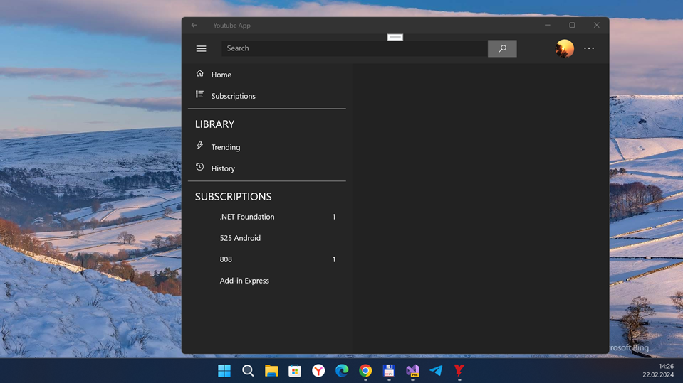
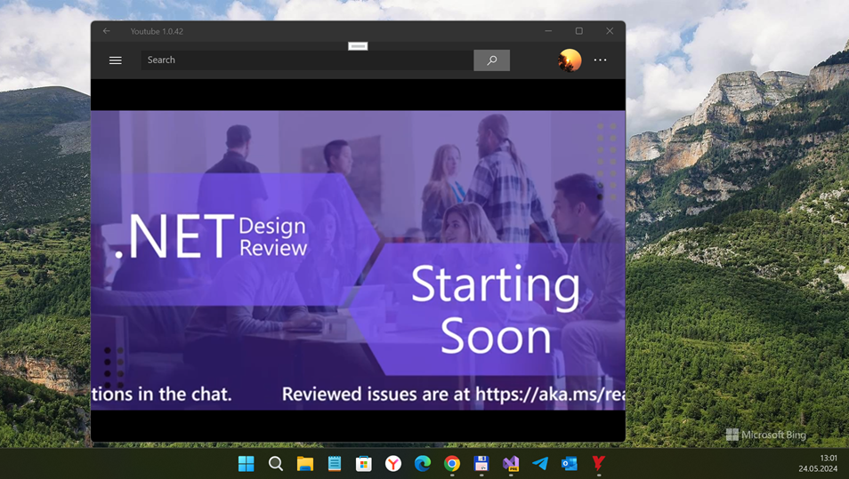
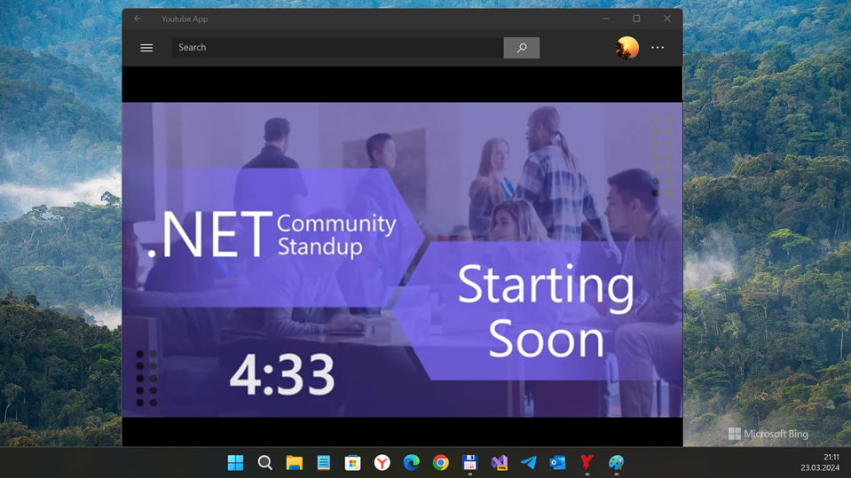

# YoutubeApp v1.0.3-alpha
My fork of Unofficial Youtube Client (UWP app for Desktop)

## About
The Unofficial Youtube Client is a youtube application built in UWP using the Google Dotnet API libraries with a goal of improving upon the ad infested and under-featured apps found on the windows store. The project strives to provide a coherent and simplistic UI while providing responsive and battery considerate performance across the board. Due to the limitations of the Google API, work arounds are being found for home page recommendations and viewing history.

## Screenshot(s)

## Features (the info from original readme...)
- Windows Styling Integration
- Hardware Video Decoding
- Exceptional Performance (for reasons listed above)
- Picture in Picture mode
- Download videos

## My 2 cents / Status 
- RnD (27 % complete)
- Min. os win sdk : 15063
- VLC & VideoLib synthez started :)
- Draft / Proto

## Big "crazy bug" what still exists till/from 2017 year
- Google auth failed ONLY ON Windows 10 Mobile OS. Not on desktop Windows 10. So strange. IMHO, this is echo of Google-MS "mobile wars". 

## Credits / References
- MIT
- https://github.com/Saghen/  Liam Dyer aka Saghen
- https://github.com/Saghen/UWP-Youtube-Twitch-Viewer/ Liam Dyer's original Unofficial Youtube Client

## How to try it / fix it
1. Use [Google developers console](https://console.developers.google.com/) to register your own Google Youtube API v3 items:
- Api key
- Client Id
- Client Secret

2. Modify that items in/at Constants.cs file

3. Run the app and explore good auth , but bad get video deals 

4. Fix the bugs 

## ..
As is. No support. RnD only. DIY

## .
[m][e] 2024

